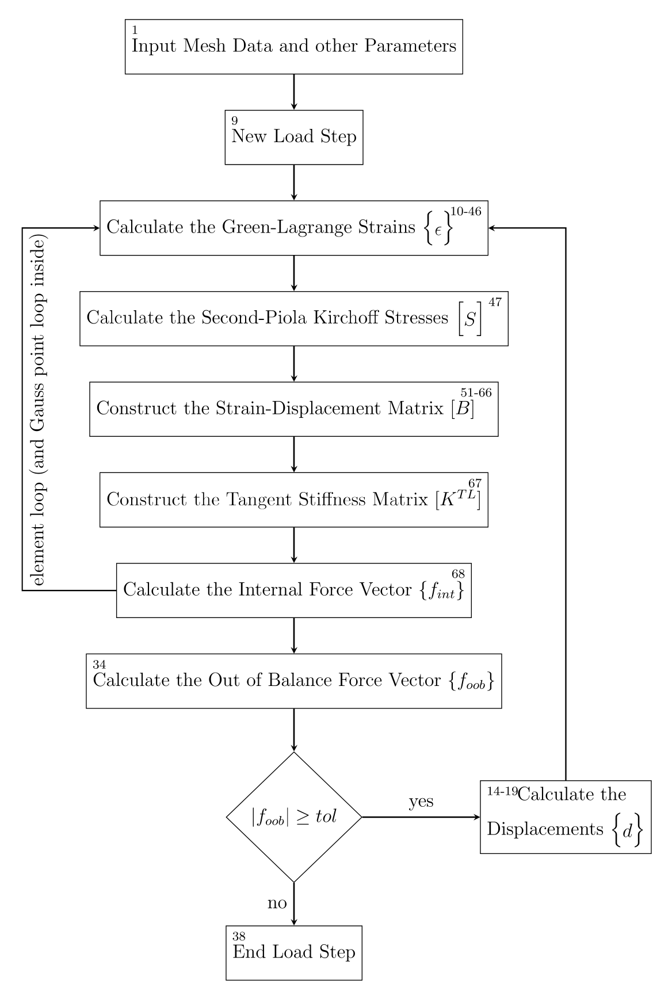

# Geometrically Non-Linear Hexahedral Finite Element
Total Lagrangian approach is used to account for the geometrically non-linear behaviour in the code provided here.

## Input Parameters
| Variable | Matrix Sizing | Format | Description |
| --- | --- | --- | --- |
| `E` | real scalar | 1e9 | Young's modulus in kPa |
| `v` | real scalar | 0 | Poisson's ratio |
| `ngp` | real scalar | 8 | Number of Gaussian scheme |
| `lstps` | real scalar | 0 | Number of load steps to apply the loads |
| `NRitmax` | real scalar | 0 | Maximum number of Newton-Raphson iteration for non-convergence cases |
| `NRtol` | real scalar | 0 | Tolerance or convergence criterion for Newton-Raphson iteration |
| `coord` | 3n * 3 | [X1 Y1 Z1] | Coordinates of the nodes |
| `etopol` | n * 8 | [n1 n2 n3 n4 n5 n6 n7 n8] | Element topology |
| `bc` | nbc * 2 | [i ui] | Boundary conditions: degrees of freedom, <math>i</math> having defined displacements of ui |
| `fext` | 3n * 1 | [f1 f2 ... f3n]T | Total applied force at each degree of freedom in kN |
| `D` | 6 * 6 * ngp * n | [D11 D12 D13 D14 D15 D16]   [D21 D22 D23 D24 D25 D26]   ... | Material properties at each Gaussian integration point and for each element |

where `n` is the number of elements, `nbc` is the number of nodes that have Dirichlet boundary condition (displacement is known). Note that the element topology has to be written in the format shown below

  

## Output Parameters
| Variable | Matrix Sizing | Format | Description |
| --- | --- | --- | --- |
| `uvw` | 3n * 1 | [d1 d2 ... d3n]T | Displacement at each degree of freedoms in m |

## Files
1. TLHexahedral.m - The main MATLAB files to run the Total-Lagrangian Geometrically Non-Linear Hexahedral FE analysis.
2. TLFE.m - Contains the functions to be ran at the element-level looping.
3. GNLcantilever_endload.m - A function file to provide a sample of input for the Geometrically Non-Linear Hexahedral FE analysis.

## Algorithm Process

  

Note that the number in top left of each procedure box relates to TLHexahedral.m while the number in the top right of each procedure box relates to the line number in the TLHE.m.
